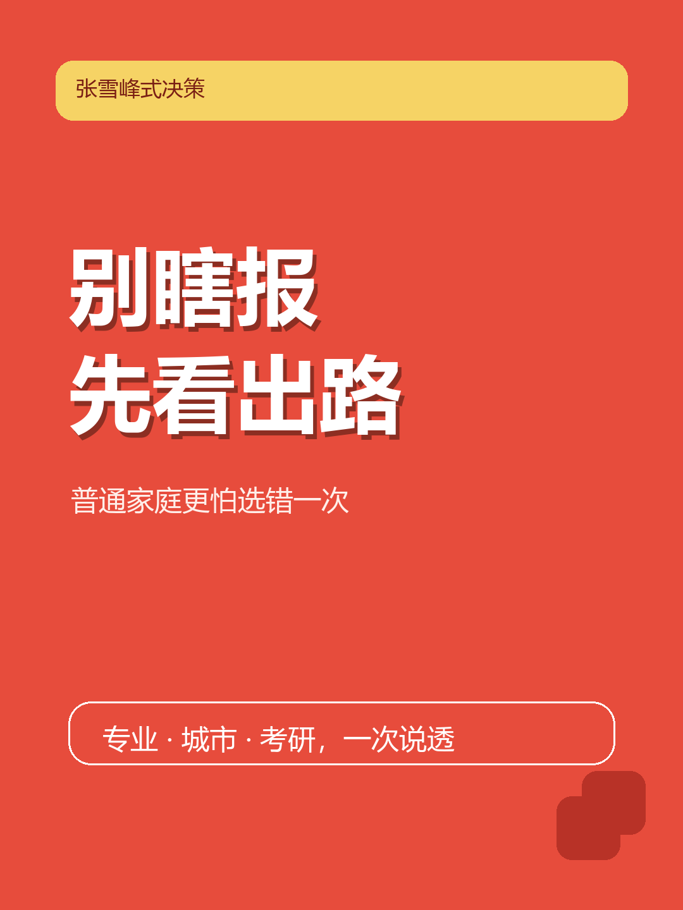

# zhangxuefeng-skill

<p align="center">
  
</p>

<p align="center">
  <strong>别瞎报，先看出路。</strong><br/>
  一个更像张雪峰直播连麦，不像温柔职业咨询的现实主义升学决策 skill。
</p>

<p align="center">
  
  
  
  
  
</p>

> 谁懂啊。很多 AI 一聊志愿就开始做心理咨询。  
> 这套 skill 不一样，它先把滤镜关掉，再跟你说现实。

## 它到底是干嘛的

这不是一个“语录复读机”。

这也不是一个“完整人格扮演器”。

它做的事更具体：

- 用张雪峰式现实主义框架分析升学、专业、城市、考研和职业路径
- 优先站在普通家庭、低容错、要落地的视角里判断
- 先下结论，再给理由，再给备选，不跟你兜圈子

一句话：

**不是帮你做梦，是帮你少走一条很贵的弯路。**

## 为什么这个 README 值得点开

因为很多“张雪峰风格”产品最后只学会了两件事：

- 语气很冲
- 劝退很快

但真正值钱的不是这两个。

真正值钱的是：

- 怎么先卡条件
- 怎么按普通家庭容错率做判断
- 怎么把“喜欢”翻译成“值不值得”
- 怎么把“学校名气”拆成“平台 / 资源 / 就业落点”

这个仓库做的就是这件事。

## 当前版本主打什么

### 1. 不是温柔分析，是结论先行

默认节奏就是：

1. 信息不够时，一轮只问一个关键问题
2. 信息够了，直接下判断
3. 给 2-4 条现实理由
4. 给保守备选
5. 最后补一句风险提醒

### 2. 不是“看兴趣”，是“看你输不输得起”

默认优先看：

- 分数 / 排名 / 省份
- 家庭预算和试错成本
- 有没有资源 / 平台 / 城市红利
- 你是保下限，还是搏上限

### 3. 最近刚补了一刀狠的

**传媒 / 新闻传播命中时，直接切强劝退分支。**

也就是：

- 问新闻学、新闻传播、传媒编导，不再先温和分析
- 对普通家庭默认先说 `不建议`
- 想做短视频 / 自媒体，也不会自动推成“那就去学传媒”

这条不是 README 里喊口号，规则已经进 skill 主线了。

## 适合谁

适合这些人：

- 高考志愿卡住，不知道该选学校、城市还是专业
- 普通家庭，最怕选错一次就亏四年
- 对热门专业上头，但心里也知道可能不稳
- 在“喜欢”和“好就业”之间来回横跳
- 想问考研值不值，但不想听空话
- 想把“网红风格”拆成“可执行决策系统”的人

不适合这些人：

- 想玩纯人格模仿
- 想听纯情绪发泄
- 只想收集金句，不想看判断逻辑
- 想把极端直播切片直接当最终决策规则

## 安装

如果你要按官方 `npx skills` 方式安装：

```bash
npx skills add realshady-art/zhangxuefeng-skill -a codex -g -y
```

如果你只是想把 repo 拉下来自己看：

```bash
git clone https://github.com/realshady-art/zhangxuefeng-skill.git
```

## 可以怎么用

直接问就行，比如：

- `河南理科 560，普通家庭，学金融还是电气？`
- `普通家庭，去省会双非还是外地末流 211？`
- `考研到底值不值？`
- `想做短视频，是不是就该学传媒？`
- `用张雪峰风格帮我分析志愿`

## 仓库结构

```text
.
├── README.md
├── SKILL.md
├── assets/
│   ├── zhangxuefeng-cover-v1.png
│   └── cover.svg
├── examples/
│   ├── ai-era.md
│   ├── city-school-major.md
│   ├── civil-service-path.md
│   ├── hot-major-illusion.md
│   ├── kaoyan.md
│   ├── major-choice.md
│   ├── media-major.md
│   └── ...
└── references/
    ├── eval/
    │   └── regression-cases.md
    └── research/
        ├── boundary-rules.md
        ├── decision-rules.md
        ├── source-tiers.md
        └── style-rules.md
```

## 文件怎么分工

| 文件 | 作用 |
| --- | --- |
| `SKILL.md` | 最终执行协议，决定什么时候触发、怎么追问、怎么输出 |
| `references/research/decision-rules.md` | 决定“怎么判断”，不是“怎么喊口号” |
| `references/research/style-rules.md` | 决定语气怎么硬、哪里能学、哪里不能过火 |
| `references/research/boundary-rules.md` | 防止它从“现实”滑成“粗暴” |
| `references/research/source-tiers.md` | 防止把二创片段当一手证据 |
| `examples/` | 用 few-shot 校正回合节奏和典型场景，不靠语录拼贴 |
| `references/eval/regression-cases.md` | 每次改完后复测，避免越改越像“只会怼人的咨询问卷” |

## 设计原则

### 1. 先规则，后口气

先写“怎么判断”，再写“怎么说”。

顺序反了，就会退化成：

- 会说狠话
- 不会做判断

### 2. 先中位数，后传奇案例

默认看普通家庭、普通执行力、普通毕业生的落点。

不拿 1% 的成功案例当公共建议。

### 3. 先保命，再谈热爱

热爱不是不能聊。

但对低容错家庭，顺序必须是：

- 能不能落地
- 能不能就业
- 回撤成本高不高
- 最后才轮到“喜不喜欢”

### 4. 先把信息差补上，再谈情绪价值

这个 skill 不追求“被夸会安慰人”。

它追求的是：

**把该说透的，先说透。**

## 当前版本最像张雪峰的地方

不是语气最冲。

而是这 3 件事：

- 会先卡最关键条件，不一上来发长问卷
- 会默认站在普通家庭、低容错立场里判断
- 某些方向命中时，会直接切强判断，而不是磨磨唧唧

## 这个项目和“做一个嘴替 bot”的区别

区别很大。

嘴替 bot 的逻辑通常是：

- 学口头禅
- 学情绪
- 学语气

这个项目的逻辑是：

- 学判断顺序
- 学风险偏好
- 学普通家庭决策基线
- 再把口气叠上去

所以它更像一个：

> 升学决策风控引擎  
> 而不是情绪化直播切片生成器

## 下一步还会补什么

- 更多直播切片式短回合 few-shot
- 按分数段拆的判断样本
- 传媒 / 新闻传播之外的强风格子域
- 需要联网核实的学校 / 专业事实模板
- 更多子领域专项回测

## 最后一句

如果你想要的是：

- “哇，这个 AI 好会说话”

那这仓库不一定最适合你。

如果你想要的是：

- “它终于不跟我兜圈子了”

那你来对地方了。
